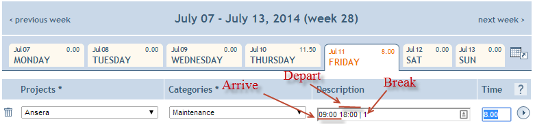

# SaM Solutions @ Search & Knowledge house rules

## First Day
On your first day at SaM Solution @ EPO you will be met by a Service Manager or nominated person at EPO entrance, there are 2 main EPO entrances:
- EPO Main building entrance. [See on Google Maps](https://www.google.nl/maps/@52.0402016,4.3368093,3a,75y,130.51h,110.74t/data=!3m6!1e1!3m4!1s2PlTW_qSECYRppawuGGB2g!2e0!7i13312!8i6656) 

- EPO Shell building entrance. [See on Google Maps](https://www.google.nl/maps/@52.0418991,4.3412057,3a,75y,200.19h,92.59t/data=!3m6!1e1!3m4!1sXiDCFwGITUab6gJ2h8Zvqg!2e0!7i13312!8i6656)

:bulb: Please have ID (passport, driver license) and optionally laptop with you. 

## Password policy
- You are not allowed to share your password with anyone.
- Your default password is the same as user ID in a lower case. 
- After the first login you will be asked to change it and the New Password needs to be now a minimum of 10 characters: and should contain at least 3 out of the 4 groups (digits/numbers, small letters, capital letters or special characters). Example: mA2hh%ZZZ7
- :bulb: Don't use Y and Z letters in your password because of Swiss-german keyboard layout

## Presence
Please make sure you are always available on-site during **core hours 10:00-12:00 and 14:00-16:00** otherwise report your absence as defined below.

#### Time tracking 
Short introduction into a timetracking system is used by SAM EPO employees and contractors
- For the purpose of timesheet generation and office time tracking we all will use http://epo.10time.info application where you already have an accounts. :bulb: Check your mailbox for a mail from 10time.info
-	Every team member **each business day** must record number of working hours by entering number of effective hours spent on EPO tasks in the office manually of using a FF/Chrome plugin. :bulb: Search your mailbox for a mail with subject "10times automation"
- The “Description” field is used to specify breakdown of your working hours (arrive-depart time and break length). The format of breakdown is **“HH:mm HH:mm | HH.hh”**, where the first timestamp is arrival time, second is a departure time and decimal after the pipe is a length of a break. In order to avoid delays with payment orders, please make sure that the breakdown and total time spent during a day corresponds to each other. According to SAM working hours policy and Dutch law it’s required to have at least half hour break daily. Average working day should not be significantly different from 8 hours (7.5 hours is OK; 12 hours is NOT OK).
 
:bulb: one and half hour = 1.50 (decimal separator) and 1:30 (time separator)

-	Your day-to-day activity category is “Development”. :bulb: it also might be “Maintenance”
- **Break** If you work for more than 5.5 hours, then you should have a break of at least 30 minutes.  see [Information about the The Working Hours Act](https://www.government.nl/government/documents/leaflets/2011/08/24/q-a-working-hours)
- In order to help SAM procurement team handle sick leave all SAM employees are welcome to use “Sick Leave” category although it’s not mandatory for non-permanent SAM employees.
- Please don’t forget to use “Official Holliday” and “Annual Leave” categories where it’s appropriate.
- Monthly time-sheet generation. On last day of every working month time records will be accumulated, verified by SAM PM Assistent and cumulative monthly report will be generated and sent to SAM procurement. 

Please make sure that you have specified every working day workload before you leave **last business day of the month**. 

#### Team calendar
Following the link [http://sharepoint2013/sites/ESSKSS/](http://sharepoint2013.internal.epo.org/sites/ESSKSS/) you can get an access to the Serch & Knowledge SaM developers team calendar - a consolidated report and forecast of development team members' presence. 

#### Vacation
Prior taking vacation please make sure it does not conflicts with major projects deadlines and vacation schedule of the other team members. Please follow the set of rules specified below:
- Discuss your vacation plan on a standup
- **Permanent staff only**, use [http://urlaubsverwaltung.sam-solutions.net/](http://urlaubsverwaltung.sam-solutions.net/) to register your vacation and get approval prior leave
- Plan your vacation in a [team calendar]( http://sharepoint.internal.epo.org/sites/sandk/Lists/SKDev/calendar.aspx?AccountId=28)
- Add your vacation days in a [timesheet](http://epo.10time.info/site/en/mainmenu/timesheet/) and make sure your timesheet is complete especially when your vacation cross a boundary between months 
- Activate "Out of office" automatic reply in Outlook

#### Sick or unscheduled leave 
In case of emergency or sick leave when you have no access to the team calendar please make sure you've notified either Service Delivery Manager or Project Manager Assistent, please find contacts below:
- **Service Manager** - [Alexander Khval](mailto:a.khval@sam-solutions.com)
- **Project Manager Assistent** - [Evgenia Poskanenkowa](mailto:E.Poskanenkowa@sam-solutions.com)

You can mail, SMS, call, [WhatsApp](https://api.whatsapp.com/send?phone=31623759269), [Telegram](https://t.me/khval), Facebook, Hangout or use any other way of communication

## Business trip
Pleae consult with Service Manager regarding business trips compensations.

## Training courses
Pleae consult with Service Manager regarding training booking and compensations.

## Code of conduct
- Integrity = pleae support each other.
- Usefulness = we are solving and not making problems.
- Privacy, Security and Outside Communications = you should also ensure your outside communications (including social media) do not disclose confidential information or represent (or otherwise give the impression) that you are speaking on behalf of Google unless you’re authorized to do so by the company.
- Responsiveness = take initiative and help any time you feel our users and clients aren’t being well-served. 

## Visitors
Make sure your visitors do not leave a public and they are always accompanied by EPO contractor or permanent staff.
In a rear case when visitor needs to visit a production area of EPO facilities please agree it with a SaM Service Manager who has a permission to request an access

## Org chart
Please find an uptodate organigram on a following [confluence page](http://confluence-p.internal.epo.org/display/Patinfo/2120+KMS+Search+Tools.+Team).

## Resignation
The notice period is [one calendar month](https://www.rijksoverheid.nl/onderwerpen/ontslag/vraag-en-antwoord/ontslag-nemen-opzegtermijn-werknemer) however we appriciate if you do it two months before resignation.
